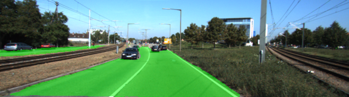
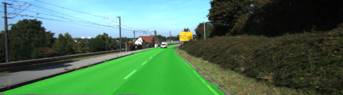
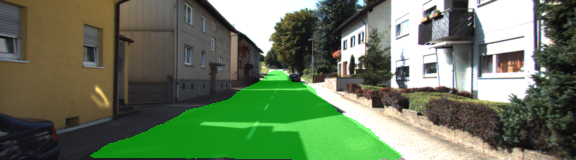
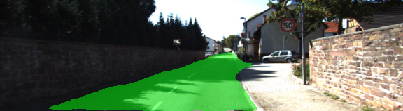

# Semantic Segmentation
### Introduction
In this project, the goal is to label the pixels of a road in images using a Fully Convolutional Network (FCN).

### Description

I have used a pre-trained VGG-16 model. The model was converted to a fully convolutional network by converting the final fully connected layer to a 1x1 convolution. Also the depth was changed to match 2 classes (what we want is to classify road/not road).

To boost performance, I have used skip connections by performing 1x1 convolutions on previous model layers. 3-rd and 4-th layers were element-wise added to upsampled through transposed convolution lower levels. Each of these convolutions also involve a kernel initializer and regularizer.

I have used an Adam optimizer for training the model, with cross-entropy loss function.

After playing with hyperparmeters, I've chosen the following which gave me good results:

- keep probability - 0.6
- learning rate - 0.0002
- epochs - 50
- batch size - 9

### Results
 Below you can see some output images from result FCN with green overlay on those places which FCN classified as 'road'.
 
 
 
 
 
 
 
 


### Start

Download the [Kitti Road dataset](http://www.cvlibs.net/datasets/kitti/eval_road.php) from [here](http://www.cvlibs.net/download.php?file=data_road.zip).  Extract the dataset in the `data` folder.  This will create the folder `data_road` with all the training a test images.

Run the following command to run the project:
```
python main.py
```